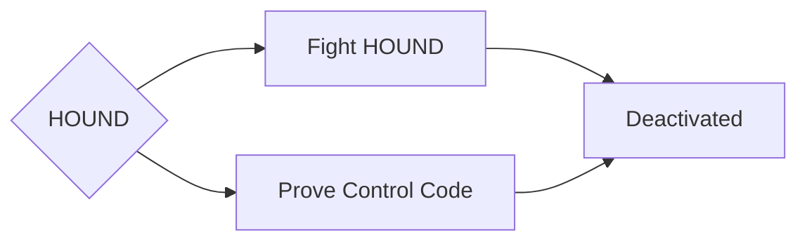

# Lore - Mob - HOUND

The foundry's guard dog, in charge of keeping the PAWN platform running smoothly.

Note that HOUND itself is a distributed system like PAWN, and each foundry has its own HOUND.

## Choices

HOUND is always paired with PAWNs and its battle can be quite difficult in the small security room.

Another alternative is to make a custom access card with the control secret from the Radio Tower and insert it into the foundry's security terminal, this will deactivated HOUND and end the hostilities as long as the code remains the same.

## Choice: Prove Control

If the player had installed an access card with the control secret found in the Radio Tower, HOUND will be summoned, but will not be hostile to the player, thus ending the hostilities across all foundries.

## Choice: Fight

The player can also choose to fight HOUND and its PAWNs, upon defeat, Nori will offer to deactivate the HOUNDs remotely, this is a more permanent solution (in reality NORI will simply write the secret directly to the network, the player however will not know the secret).
