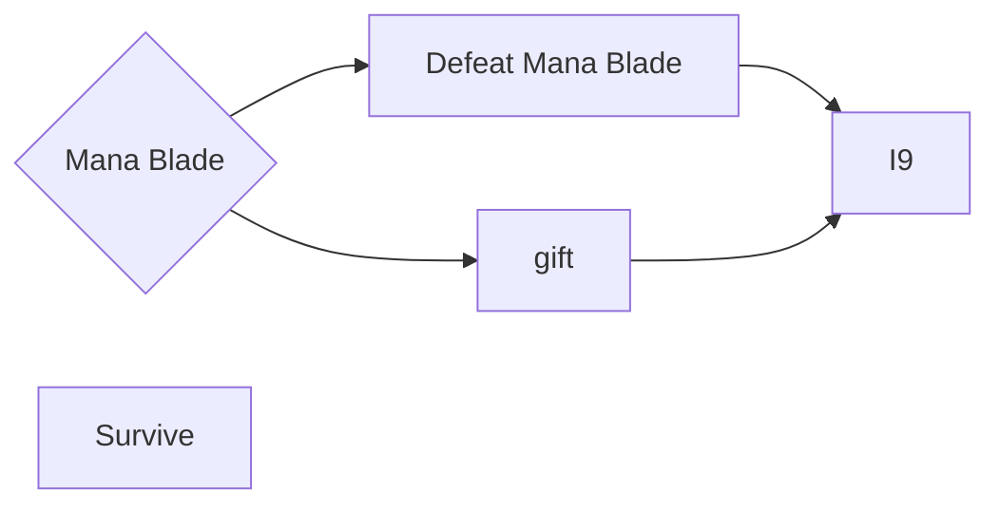

# Lore - Mob - Mana Blade

Mana Blade is a boss which appears in the [Mana Wave](/docs/modes/surface_story/progression/040_mana_blade.md) arc of the Surface Story.

As mana returned to the world of Harmonia, so did it return to his core, originally created as a defence against the spread of the mana plague, tasked with the difficult job of killing those that had gone insane, he roamed the world.

Unfortunately for the PC, he has symptoms similar to that of the mana plague.

## Battle

Mana Blade will attack the player relentlessly once it spawns, it can be defeated or pacified.

Mana Blade's primary attack is single strike from its dagger, it can sometimes switch to a tome to blink towards the player if they are too far away.

## Choices

Players generally have two ways of dealing with the Mana Blade.

### Choice: Survive

It sounds easy, but the player must survive against mana blade for a minute without attacking, else the timer resets.

### Choice: Defeat

Just best Mana Blade, sounds easy yeah?
