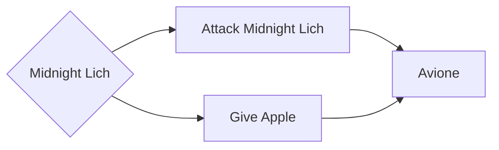

# Lore - Mob - Midnight Lich

The Midnight Lich is a boss mob that appears in the [Grave Callings](/docs/modes/surface_story/progression/020_grave_callings.md) arc of the Surface Story.

This mob is a [character](/docs/lore/characters/avione.md).

The Midnight Lich spawns at night in the Graveyard(s) and is generally non-hostile.

## Choices

Players generally have two ways of dealing with the Midnight Lich.

### Choice: Gift

Players may offer the Midnight Lich the gift of an apple which is enough to awaken them from their zombie state.

This will immediately transition them to their NPC [Avione](/docs/lore/characters/avione.md).

### Choice: Fight

Players may choose to fight the Midnight Lich by simply attacking it and starting the battle, upon defeat they will drop their loot and vanish for the remainder of the night.

They will re-appear from then on as the NPC [Avione](/docs/lore/characters/avione.md).

## Loot

Either upon defeat or by pacifying the Midnight Lich they will immediately add the [Bio Lab Access Card](/docs/lore/items/bio_lab_access_card.md)
