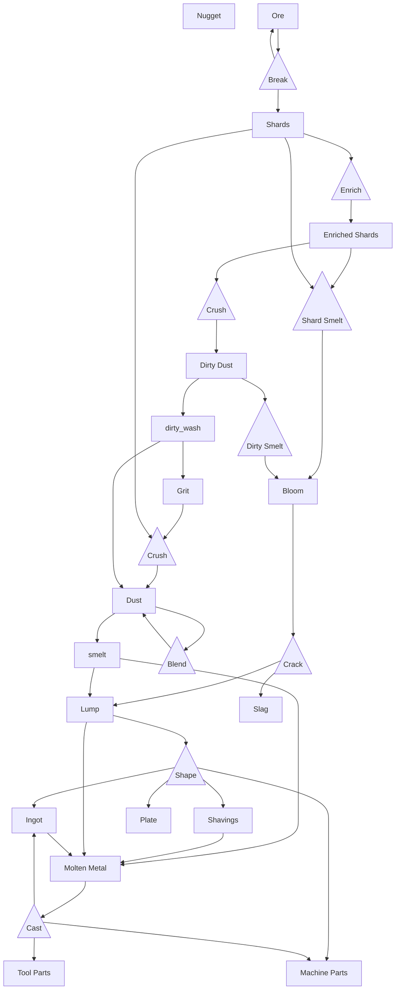

# Mechanic - Metallurgy

```mermaid
flowchart TD
  bloom["Bloom"]
  dust["Dust"]
  dirty_dust["Dirty Dust"]
  ingot["Ingot"]
  lump["Lump"]
  nugget["Nugget"]
  ore["Ore"]
  shards["Shards"]
  enriched_shards["Enriched Shards"]
  shavings["Shavings"]
  slag["Slag"]
  molten_metal["Molten Metal"]
  grit["Grit"]
  machine_parts["Machine Parts"]
  tool_parts["Tool Parts"]
  plate["Plate"]

  break@{shape: tri, label: "Break"}
  crack@{shape: tri, label: "Crack"}
  crush@{shape: tri, label: "Crush"}
  dirty_crush@{shape: tri, label: "Crush"}
  dirty_smelt@{shape: tri, label: "Dirty Smelt"}
  shard_smelt@{shape: tri, label: "Shard Smelt"}
  shape@{shape: tri, label: "Shape"}
  cast@{shape: tri, label: "Cast"}
  enrich@{shape: tri, label: "Enrich"}
  blend@{shape: tri, label: "Blend"}

  ore --> break --> shards & ore
  grit & shards --> crush --> dust
  enriched_shards & shards --> shard_smelt --> bloom --> crack --> lump & slag
  shards --> enrich --> enriched_shards --> dirty_crush --> dirty_dust --> dirty_wash --> dust & grit

  dust --> blend --> dust
  dust --> smelt --> lump & molten_metal
  dirty_dust --> dirty_smelt --> bloom

  lump --> shape --> ingot & plate & machine_parts & shavings
  shavings & lump & ingot --> molten_metal --> cast --> ingot & tool_parts & machine_parts
```

