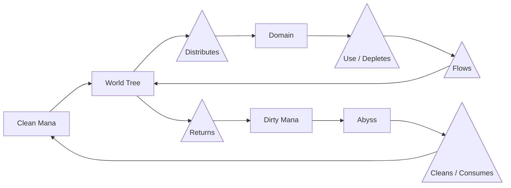

# Mechanic - World Mana

__Type__ Resource, Function

World Mana is multiple systems present in the game that handle the mana cycle.

## Mana Cycle

The Abyss provides clean mana to the Domain or World through its world tree typically, but can also do so directly.

When mana is consumed or used for magic or other applications, it is converted into Dirty Mana[^dirty_mana], it is then returned to the Abyss via the World Tree which consumes the "Dirty" part of the mana and returns it to its clean state.

Ultimately it is a closed loop between the Abyss and Domain/World where the World Tree acts as an intermediate.

Harmonia however, is missing its world tree and so the Abyss can provide mana, but there is no clear return path for Dirty Mana[^dirty_mana].

## Scratchpad

As of this writing, 2026-01-02, mana would be generated per block and then spread over each block until it reaches equilibrium; this was fine when the mana system wasn't completely fleshed out and there was no "lore" behind it.

However with mana fleshed out as being tied to memories, it has almost zero reason to just "generate" out of the blue, it needs something, something that creates memory.

## Footnotes

[^dirty_mana] [Dirty Mana](dirty_mana.md)
